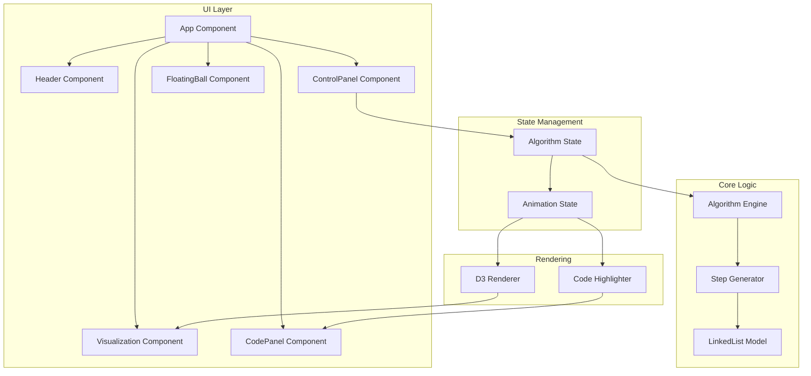

# Design Document

## Overview

本项目是一个基于 TypeScript + React + D3.js 的算法可视化教学应用，用于演示 LeetCode 第 24 题「两两交换链表中的节点」。应用采用单页面架构，通过分步骤动画展示算法执行过程，同时提供代码调试视图让用户理解每一步的代码逻辑和变量状态。

### 技术栈

- **前端框架**: React 18 + TypeScript
- **可视化库**: D3.js
- **构建工具**: Vite
- **代码高亮**: Prism.js 或 highlight.js
- **部署**: GitHub Pages + GitHub Actions

## Architecture



## Components and Interfaces

### 1. App Component

根组件，负责整体布局和状态管理。

```typescript
interface AppProps {}

interface AppState {
  currentStep: number;
  isPlaying: boolean;
  playbackSpeed: number;
  testCase: number[];
}
```

### 2. Header Component

页面头部，包含标题和 GitHub 链接。

```typescript
interface HeaderProps {
  title: string;
  leetcodeUrl: string;
  githubUrl: string;
}
```

### 3. Visualization Component

D3.js 链表可视化区域。

```typescript
interface VisualizationProps {
  linkedList: LinkedListState;
  highlightedNodes: HighlightedNodes;
  pointers: PointerState;
}

interface LinkedListState {
  nodes: VisualNode[];
  edges: VisualEdge[];
}

interface VisualNode {
  id: string;
  value: number;
  x: number;
  y: number;
  highlight: 'current' | 'prev' | 'temp' | 'next' | null;
}

interface VisualEdge {
  source: string;
  target: string;
  isChanging: boolean;
}
```

### 4. CodePanel Component

代码展示和调试效果组件。

```typescript
interface CodePanelProps {
  code: string;
  currentLine: number;
  variables: VariableState[];
}

interface VariableState {
  name: string;
  value: string;
  line: number;
}
```

### 5. ControlPanel Component

播放控制面板。

```typescript
interface ControlPanelProps {
  currentStep: number;
  totalSteps: number;
  isPlaying: boolean;
  onPrevious: () => void;
  onNext: () => void;
  onPlayPause: () => void;
  onReset: () => void;
}
```

### 6. FloatingBall Component

微信群悬浮球组件。

```typescript
interface FloatingBallProps {
  qrCodeImage: string;
  tooltipText: string;
}
```

### 7. Algorithm Engine

算法执行引擎，生成所有步骤。

```typescript
interface AlgorithmEngine {
  generateSteps(input: number[]): AnimationStep[];
  getStep(index: number): AnimationStep;
  getTotalSteps(): number;
}

interface AnimationStep {
  stepIndex: number;
  description: string;
  linkedList: ListNode | null;
  visualState: LinkedListState;
  currentLine: number;
  variables: VariableState[];
  pointers: {
    current: string | null;
    prev: string | null;
    temp: string | null;
  };
}
```

### 8. LinkedList Model

链表数据模型。

```typescript
interface ListNode {
  id: string;
  val: number;
  next: ListNode | null;
}

interface LinkedListOperations {
  createFromArray(arr: number[]): ListNode | null;
  toArray(head: ListNode | null): number[];
  clone(head: ListNode | null): ListNode | null;
}
```

## Data Models

### AnimationStep

每个动画步骤的完整状态快照。

```typescript
interface AnimationStep {
  // 步骤索引
  stepIndex: number;
  
  // 步骤描述（用于展示给用户）
  description: string;
  
  // 当前链表状态（逻辑结构）
  linkedListHead: ListNode | null;
  
  // 可视化状态（用于 D3 渲染）
  visualNodes: VisualNode[];
  visualEdges: VisualEdge[];
  
  // 代码高亮行号（1-indexed）
  highlightLine: number;
  
  // 变量状态
  variables: {
    fakeHead: string;
    current: string;
    prev: string;
    temp: string;
  };
  
  // 指针高亮
  pointerHighlights: {
    nodeId: string;
    pointerType: 'current' | 'prev' | 'temp' | 'fakeHead';
  }[];
}
```

### VisualNode

可视化节点数据。

```typescript
interface VisualNode {
  id: string;           // 唯一标识
  value: number;        // 节点值
  x: number;            // X 坐标
  y: number;            // Y 坐标
  highlight: NodeHighlight | null;
}

type NodeHighlight = 'current' | 'prev' | 'temp' | 'fakeHead' | 'swapping';
```

### VisualEdge

可视化边（指针）数据。

```typescript
interface VisualEdge {
  id: string;
  sourceId: string;
  targetId: string;
  isAnimating: boolean;  // 是否正在动画中
  isNew: boolean;        // 是否是新创建的边
  isRemoving: boolean;   // 是否正在移除
}
```

## Error Handling

### 输入验证

- 空数组输入：正常处理，显示空链表状态
- 单元素数组：正常处理，显示无需交换的状态
- 超出范围的步骤索引：边界检查，禁用相应按钮

### 动画错误

- D3 渲染失败：显示错误提示，提供重试选项
- 步骤数据不一致：回退到初始状态

### 资源加载

- 图片加载失败：显示占位符
- 代码高亮库加载失败：降级为纯文本显示


## Correctness Properties

*A property is a characteristic or behavior that should hold true across all valid executions of a system-essentially, a formal statement about what the system should do. Properties serve as the bridge between human-readable specifications and machine-verifiable correctness guarantees.*

### Property 1: 链表渲染一致性

*For any* 输入数组，渲染生成的可视化节点数量应该等于数组长度，且每个节点的 value 应该与数组对应位置的值一致；边的数量应该等于节点数量减 1（非空链表情况下）。

**Validates: Requirements 1.1, 1.2**

### Property 2: 算法结果正确性

*For any* 输入链表，执行完所有步骤后的链表状态应该与直接调用 swapPairs 算法的结果一致。

**Validates: Requirements 1.1**

### Property 3: 步骤导航一致性

*For any* 有效步骤索引 n（0 < n < totalSteps），从步骤 n 执行 prevStep 后再执行 nextStep，应该回到步骤 n 且状态完全一致。

**Validates: Requirements 2.1, 2.2**

### Property 4: 步骤边界检查

*For any* 步骤状态，当 currentStep === 0 时 canGoPrev 应该返回 false；当 currentStep === totalSteps - 1 时 canGoNext 应该返回 false。

**Validates: Requirements 2.5, 2.6**

### Property 5: 代码行号有效性

*For any* 动画步骤，其 highlightLine 值应该在 [1, totalCodeLines] 范围内。

**Validates: Requirements 3.2**

### Property 6: 变量状态与链表一致性

*For any* 动画步骤，变量 current、prev、temp 的值应该与该步骤链表中对应节点的实际引用一致。

**Validates: Requirements 3.3**

### Property 7: 变量格式化输出

*For any* ListNode 或 null 值，formatVariable 函数应该返回 "null"（当值为 null 时）或 "Node(val)" 格式的字符串（当值为节点时）。

**Validates: Requirements 3.5**

### Property 8: 测试用例重置一致性

*For any* 测试用例数组，调用 reset 后，currentStep 应该为 0，且初始链表状态应该与输入数组一致。

**Validates: Requirements 6.2**

### Property 9: 节点高亮正确性

*For any* 动画步骤，pointerHighlights 中标记的节点 ID 应该存在于当前链表的节点集合中。

**Validates: Requirements 1.4**

## Testing Strategy

### 测试框架选择

- **单元测试**: Vitest（与 Vite 集成良好）
- **属性测试**: fast-check（TypeScript 原生支持的属性测试库）
- **组件测试**: React Testing Library

### 单元测试覆盖

1. **LinkedList 模型测试**
   - createFromArray 正确创建链表
   - toArray 正确转换链表为数组
   - clone 正确深拷贝链表

2. **Algorithm Engine 测试**
   - generateSteps 生成正确数量的步骤
   - 每个步骤的状态正确

3. **组件渲染测试**
   - Header 组件正确渲染标题和链接
   - ControlPanel 按钮状态正确
   - CodePanel 代码高亮正确

### 属性测试覆盖

每个属性测试配置运行 100 次迭代。

1. **Property 1 测试**: 生成随机数组，验证渲染节点数量和值的一致性
2. **Property 2 测试**: 生成随机链表，验证算法执行结果正确性
3. **Property 3 测试**: 生成随机步骤索引，验证导航往返一致性
4. **Property 4 测试**: 生成随机步骤状态，验证边界检查逻辑
5. **Property 5 测试**: 生成所有步骤，验证代码行号有效性
6. **Property 6 测试**: 生成随机步骤，验证变量状态一致性
7. **Property 7 测试**: 生成随机节点或 null，验证格式化输出
8. **Property 8 测试**: 生成随机测试用例，验证重置一致性
9. **Property 9 测试**: 生成随机步骤，验证高亮节点存在性

### 测试标注格式

每个属性测试必须使用以下格式标注：

```typescript
// **Feature: leetcode-swap-nodes-visualization, Property 1: 链表渲染一致性**
```

### 边界情况测试

- 空数组输入 `[]`
- 单元素数组 `[1]`
- 两元素数组 `[1, 2]`
- 奇数长度数组 `[1, 2, 3]`
- 最大长度数组（100 个元素）

